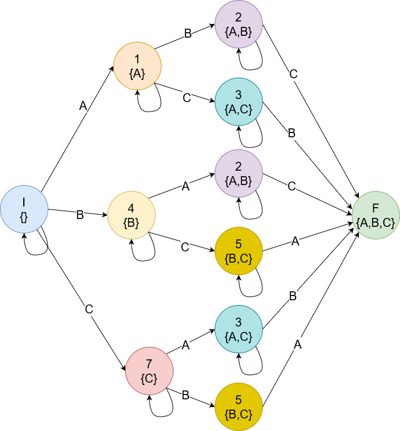

# Консистентность данных при работе с Apache Cassandra

**TLDR Используете комбинацию Factory Method и Builder для создания объектов при сохранении информации в Apache Cassandra**

**DISCLAIMER**

> Статья не является учебным материалом по проектированию модели данных для Apache Cassandra. Ожидается, что читатель имеет опыт работы с Apache Cassandra. Примеры кода приводятся на Java, которые при желании можно переложить на любой другой язык

# Мотивация

Apache Cassandra - база данных, в которой запись информации гораздо быстрее чтения, поэтому особенность моделирования схемы данных для Apache Cassandra состоит в том, чтобы исключить лишние расходы на чтение. Так все, что может затормозить чтение (объединения, слияния, группировки, фильтрация по колонкам без "индексов") идет "под нож".

В реляционных базах данных модель данных проектируется от сущности, т.е Данные -> Модель -> Приложение. Для Apache Cassandra подход выворачивается наизнанку, и проектирование данных ведется для конкретного приложения, т.е. Приложение -> Модель -> Данные.

Перед программистом встают следующие проблемы:

- Каждый запрос читает данных из своей собственной таблицы, а значит одна операция записи в Apache Cassandra может выполнять несколько вставок одинаковых данных в несколько таблиц. Дублирование данных ведет к неконсистентному состоянию, что крайне нежелательно для надежных систем.
- Каждый запрос должен выполняться быстро, а значит должен быть некий "индекс" для получения данных за константное или в худшем случае логарифмическое время. Каждая колонка, участвующая в "индексе" должна быть проинициализирована.

В статье предлагается вариант организации клиентского API для решения проблем с консистентностью данных и инициализации требуемых полей на базе комбинации паттернов проектирования **Factory Method**, **Builder** и **State Machine**

# Предметная область

В демонстрационных целях рассмотрим приложение для бронирования номеров в отелях. Основные сценарии:

- пользователи могут фильтровать отели по звездности,
- пользователи могут находить отели рядом с метро,
- пользователи могут посмотреть список номеров по отелю,
- пользователи могут посмотреть удобства в номере,
- пользователи могут забронировать номер в отеле.
 
## Схема данных

### Объекты в Apache Cassandra

По списку сценариев строится **Диаграмма Чеботко** - графическое представление физической модели данных Apache Cassandra.


Пояснение к диаграмме Чеботко:

- комбинация полей, помеченных `K` и `C`, образует первичный ключ,
- `K` - маркер ключа раздела/партиционирования (**partitioning key**). По ключу партиционирования возможны запросы лишь на равенство,
- `C` - маркер ключа кластеризации (**clustering key**). По ключам кластеризации возможны запросы `=`, `>`, `<`, `>=`, `<=`, `BETWEEN` в **пределах раздела**,
- `C↓` - маркер ключа кластеризации, значения в котором хранятся в порядке убывания. Поля входящие в ключ кластеризации физически хранятся на диске в отсортированном виде. По умолчанию используется порядок по возрастанию.

Согласно диаграмме Чеботко в базе имеются следующие сущности:

- `hotels_by_id` - список отелей,
- `rooms_by_hotel` - список номеров в отеле,
- `reservations_by_hotel` - информация о забронированных номерах в отеле,
- `hotels_by_metro` - отели рядом со станцией метро,
- `hotels_by_stars` - отели по звёздности,
- `amenities_by_room` - удобства в номере.

Можно заметить, что существуют аттрибуты, которые содержатся одновременно в нескольких таблицах. Например:

- `hotel_name` (имя отеля): содержится в `hotels_by_id`, `room_by_hotel`, `reservations_by_hotel`, `hotels_by_stars`, `hotels_by_station`,
- `hotel_id` (идентификатор отеля): содержится в `hotels_by_id`, `room_by_hotel`, `reservations_by_hotel`, `hotels_by_stars`, `hotels_by_station`,
- `stars` (уровень звёздности): содержится в `hotels_by_id`, `hotels_by_stars`,
- `room_id` (идентификатор номера): содержится в `room_by_hotel`, `amenities_by_room`, `reservations_by_hotel`.

Дублирование данных позволяет избежать операций join и является общепринятым методом проектирования модели данных для Apache Cassandra. Например, чтобы получить список отелей рядом с определенной станцией метро необходимо выполнить запрос к таблице `hotels_by_station`

Добавление данных в базу данных потребует одновременной записи одинаковых данных в разные таблицы.

### Отображение таблиц на объекты

```java
@Table(value = "hotels_by_metro")
public class HotelByStation {

    @PrimaryKeyColumn(type = PrimaryKeyType.PARTITIONED, ordinal = 0, name = "station_name")
    @CassandraType(type = CassandraType.Name.TEXT)
    private String station;

    @PrimaryKeyColumn(type = PrimaryKeyType.CLUSTERED, ordinal = 1, name = "hotel_name")
    @CassandraType(type = CassandraType.Name.TEXT)
    private String hotelName;

    @Column("hotel_id")
    @CassandraType(type = CassandraType.Name.UUID)
    private UUID hotelId;

    public HotelByStation(String station, String hotelName, UUID hotelId) {
        this.station = station;
        this.hotelName = hotelName;
        this.hotelId = hotelId;
    }
}
```
```java
@Table(value = "hotels_by_id")
public class HotelById {

    @PrimaryKeyColumn(type = PrimaryKeyType.PARTITIONED, ordinal = 0, name = "hotel_id")
    @CassandraType(type = CassandraType.Name.UUID)
    private UUID hotelId;

    @Column("hotel_name")
    @CassandraType(type = CassandraType.Name.TEXT)
    private String hotelName;

    @Column("stars")
    @CassandraType(type = CassandraType.Name.TINYINT)
    private int stars;

    @Column("description")
    @CassandraType(type = CassandraType.Name.TEXT)
    private String description;

    public HotelById(UUID hotelId, String hotelName, int stars, String description) {
        this.hotelId = hotelId;
        this.hotelName = hotelName;
        this.stars = stars;
        this.description = description;
    }
}
```

```java
@Table(value = "hotels_by_stars")
public class HotelByStars {
    @PrimaryKeyColumn(type = PrimaryKeyType.PARTITIONED, ordinal = 0, name = "stars")
    @CassandraType(type = CassandraType.Name.TINYINT)
    private int stars;

    @PrimaryKeyColumn(type = PrimaryKeyType.CLUSTERED, ordinal = 1, name = "hotel_name")
    @CassandraType(type = CassandraType.Name.TEXT)
    private String hotelName;

    @CassandraType(type = CassandraType.Name.UUID)
    @Column("hotel_id")
    private UUID hotelId;

    public HotelByStars(int stars, String hotelName, UUID hotelId) {
        this.stars = stars;
        this.hotelName = hotelName;
        this.hotelId = hotelId;
    }
}
```

## Задача

Добавить новый отель. При добавлении нового отеля необходимо выполнить запись в таблицы: `hotels_by_id`, `hotels_by_metro`, `hotels_by_stars`

### Решение

В общем виде решение будет выглядеть следующим образом:

- метод `HotelInserter#addNewHotel` принимает объект типа `CassandraOperations` для работы с базой данных Apache Cassandra,
- метод `HotelInserter#addNewHotel` запускает вставку объектов через `LOGGED BATCH`,
- метод `HotelInserter#getEntities` возвращает список из трех объектов (по одному на таблицу), которые нужно вставить в базу,
- метод `HotelInserter#getEntities` создает объекты, в которых много дублирующихся данных.

```java
public class HotelInserter {
    
    public static void addNewHotel(CassandraOperations ops) {
        List<Object> entities = getEntities(/* опущено */);

        ops.batchOps(BatchType.LOGGED)
                .insert(entities)
                .execute();
    }

    private static List<Object> getEntities(UUID hotelId, String hotelName, int stars, String description, String station) {
        return null;
    }
}
```

#### Решение 1. Создание объектов на месте

Самым простым вариантом будет создание объектов на месте.
```java
public class HotelInserter {

    public static void addNewHotel(CassandraOperations ops) {
        // опущено
    }
    
    private static List<Object> getEntities(UUID hotelId, String hotelName, int stars, String description, String station) {
        HotelById hotelById = new HotelById(hotelId, hotelName, stars, description);
        HotelByStars hotelByStars = new HotelByStars(stars, hotelName, hotelId);
        HotelByStation hotelByStation = new HotelByStation(station, hotelName, hotelId);

        return Arrays.asList(hotelById, hotelByStars, hotelByStation);
    }
}
```

К плюсам можно отнести:

- простота решения - мало времени тратится на написание кода.

Из минусов можно выделить:

- ригидность - на момент создания объектов значения всех полей должны быть известны,
- повышенная когнитивная нагрузка - программист должен быть внимателен при указании аттрибутов в конструкторах,
- нарушение принципа Separation of Concerns/Разделение ответственностей - объединены этапы конструирования объектов и их использование.

Аналогичный код можно найти в репозиториях DataStax с примерами работы с базой данных Apache Cassandra.

#### Решение 2. Использование фабричного метода

Абстрагировать процесс создания объектов можно при помощи вариации паттерна проектирования Factory Method (Фабричный метод). Обычно Factory Method позволяет создать объект одного типа, но ничто не мешает объявить дополнительные методы, которые будут создавать объекты другого типа.

```java
public final class HotelFactory {
    private final int stars;
    private final String description;
    private final String hotelName;
    private final String station;
    private final UUID hotelId;

    HotelFactory(final int stars,
                 final String description,
                 final String hotelName,
                 final String station,
                 final UUID hotelId) {
        this.stars = stars;
        this.description = description;
        this.hotelName = hotelName;
        this.station = station;
        this.hotelId = hotelId;
    }

    public HotelById createHotelById() {
        return new HotelById(hotelId, hotelName, stars, description);
    }

    public HotelByStars createHotelByStars() {
        return new HotelByStars(stars, hotelName, hotelId);
    }

    public HotelByStation createHotelByStation() {
        return new HotelByStation(station, hotelName, hotelId);
    }
}
```

Если остановиться на этом, то решение будет похоже на предыдущий метод, но с одной дополнительной абстракцией. Добавление паттерна проектирования Builder сильно изменит решение в лучшую сторону:

1. Новый метод для создания Builder:
```java
public final class HotelFactory {
    // поля и методы опущены

    public static Builder builder() {
        return new Builder();
    }
}
```
2. Класс Builder:
```java
public static final class Builder {
    private int stars;
    private String description;
    private String hotelName;
    private String station;
    private UUID hotelId;

    private Builder() {
    }

    public Builder setStars(int stars) {
        this.stars = stars;
        return this;
    }

    public Builder setDescription(String description) {
        this.description = description;
        return this;
    }

    public Builder setHotelName(String hotelName) {
        this.hotelName = hotelName;
        return this;
    }

    public Builder setStation(String station) {
        this.station = station;
        return this;
    }

    public Builder setHotelId(UUID hotelId) {
        this.hotelId = hotelId;
        return this;
    }

    public HotelFactory createHotelFactory() {
        return new HotelFactory(stars, description, hotelName, station, hotelId);
    }
}
```

При помощи фабрики можно создать требуемые объекты:
```java
public class HotelInserter {

    public static void addNewHotel(CassandraOperations ops) {
        // опущено
    }

    private static List<Object> getEntities(UUID hotelId, String hotelName, int stars, String description, String station) {
        HotelFactory.Builder builder = HotelFactory.builder()
                .setHotelId(hotelId)
                .setHotelName(hotelName)
                .setDescription(description)
                .setStars(stars)
                .setStation(station);

        HotelFactory hotelFactory = builder.createHotelFactory();

        // Создание объектов через фабрику
        HotelById hotelById = hotelFactory.createHotelById();
        HotelByStars hotelByStars = hotelFactory.createHotelByStars();
        HotelByStation hotelByStation = hotelFactory.createHotelByStation();

        return Arrays.asList(hotelById, hotelByStars, hotelByStation);
    }
}
```

К плюсам тут можно отнести:

- гибкость, которую дает шаблон проектирования Builder - больше нет необходимости указывать все аттрибуты сразу, наполнение Builder может быть растянуто по коду на столько на сколько это необходимо,
- сниженная когнитивная нагрузка - программисту проще указывать значения,
- изоляция кода создания объектов от кода использования объектов.

Из минусов можно выделить:

- Программист должен следить за тем, указал ли он полностью все необходимые значения. Если пропустить какой-то аттрибут, который участвует в первичном ключе, то можно получить проблемы.
- Объект Builder подвержен мутациям, а значит возможны гонки данных в многопоточной среде.

Дополнительно

Предложенный подход можно рассмотреть так:

- шаблон Builder формирует множество аттрибутов, которые объединены каким-то признаком (причастностью к отелю в данном случае),
- модифицированный шаблон Factory Method реализует проекции из этого множества. Каждая проекция выделяет некоторое подмножество, из которого можно создать какой-то объект.

Таким образом, если появится новая таблица, то будет необходимо добавить новую проекцию/метод. При этом клиентский код не сломается, что может привести базу в неконсистентное состояние.

#### Решение 3. Добавление конечного автомата

Решение с Factory Method + Builder будет достаточным в большинстве случаев. Клиентский API можно сделать еще безопаснее с точки зрения типов.

Анализировать наполнение множества аттрибутов при помощи Builder можно при помощи некоторого аналога "парсера" или "регулярного выражения". В множестве аттрибутов, доступных пользователю для инициализации, есть обязательные и необязательные аттрибуты:

- обязательные аттрибуты - это значения для полей, входящих в первичный ключ,
- необязательные аттрибуты - это значения, которые не входят ни в один первичный ключ.

Набор введенных аттрибутов является входной строкой, а каждый введенный аттрибут - символом входной строки.

Тогда, предположим, что имеется пять аттрибутов: три обязательных (`A`, `B` и `C`) и два необязательных (`D` и `Е`). Паттерн Builder не ограничивает пользователя, а значит он может добавлять значения в любом порядке. Тогда регулярное выражение, которое проверит допустимость введенных пользователем аттрибутов выглядит так:
```
.*(A.*B.*C)|(A.*C.*B)|(B.*A.*C)|(B.*C.*A)|(C.*A.*B)|(C.*B.*A).*
```
Таким образом, пользователь должен указать значения для `A`, `B`, `C` в любом порядке, и между этими значениями могут быть установлены дополнительные необязательные аттрибуты.

Из "книги с драконом" известно любое регулярное выражение можно представить как конечный автомат, тогда



Пояснения к диаграмме:

- кружки означают состояния,
- кружки одного цвета означают одно состояние,
- `I` - начальное состояние,
- `F` - допускающее состояние,
- буквы в фигурных скобках означают множество обязательных аттрибутов, которые были уже указаны,
- стрелки с буквами означают условный переход из одного состояние в другое, если указанный символ встретился в последовательности,
- стрелки без букв означают безусловный переход,
- условные переходы имеют приоритет над безусловными переходами.

Таким образом, можно считать:

- вначале нет ни одного установленного аттрибута: множество обязательных аттрибутов в начальном состоянии пустое,
- допускающее состояние говорит о том, что все обязательные аттрибуты были установлены: множество обязательных аттрибутов содержит их все.

Кодировать множества фиксированного размера можно при помощи набора нулей и единиц:

- выделить массив размера, соответствующего максимальному количеству элементов в множестве (оно конечно),
- каждому возможному элементу поставить в соответствие индекс в массиве,
- добавление элемента в множество - установка единицы в соответствующем индексе,
- проверка наличия элемента - проверка наличия единицы в соответствующем индексе.

Вместо нулей и единиц можно использовать любые значения, в том числе и типы, что открывает дорогу к сильным типам, которые проверяют инварианты на этапе компиляции.

Объявим специальные типы означающие наличие или отсутствие элемента:
```java
public interface State {}
public interface Present extends State {}
public interface Absent extends State {}
```

Класс Builder через свои обобщенные аргументы будет отслеживать какие аттрибуты уже были установлены:
```java
public static final class Builder<
        HOTEL_ID_STATE extends State,
        STARS_STATE extends State,
        STATION_STATE extends State,
        HOTEL_NAME_STATE extends State
        > {
    private final int stars;
    private final String description;
    private final String hotelName;
    private final UUID hotelId;
    private final String station;

    public Builder(int stars, String description, String hotelName, UUID hotelId, String station) {
        this.stars = stars;
        this.description = description;
        this.hotelName = hotelName;
        this.hotelId = hotelId;
        this.station = station;
    }

    public Builder<Present, STARS_STATE, STATION_STATE, HOTEL_NAME_STATE> setHotelId(UUID hotelId) {
        return new Builder<>(stars, description, hotelName, hotelId, station);
    }

    public Builder<HOTEL_ID_STATE, Present, STATION_STATE, HOTEL_NAME_STATE> setStars(int stars) {
        return new Builder<>(stars, description, hotelName, hotelId, station);
    }

    public Builder<HOTEL_ID_STATE, STARS_STATE, Present, HOTEL_NAME_STATE> setStation(String station) {
        return new Builder<>(stars, description, hotelName, hotelId, station);
    }

    public Builder<HOTEL_ID_STATE, STARS_STATE, STATION_STATE, Present> setHotelName(String hotelName) {
        return new Builder<>(stars, description, hotelName, hotelId, station);
    }

    public Builder<HOTEL_ID_STATE, STARS_STATE, STATION_STATE, HOTEL_NAME_STATE> setDescription(String description) {
        return new Builder<>(stars, description, hotelName, hotelId, station);
    }
}
```

Фабрика примет следующий вид:
```java
public class HotelStateMachineFactory {
    private final int stars;
    private final String description;
    private final String hotelName;
    private final String station;
    private final UUID hotelId;

    public static HotelStateMachineFactory of(Builder<Present, Present, Present, Present> builder) {
        return new HotelStateMachineFactory(builder.stars, builder.description, builder.hotelName, builder.station, builder.hotelId);
    }

    public static Builder<Absent, Absent, Absent, Absent> builder() {
        return new Builder<>(-1, null, null, null, null);
    }

    public HotelById createHotelById() {
        return new HotelById(hotelId, hotelName, stars, description);
    }

    public HotelByStars createHotelByStars() {
        return new HotelByStars(stars, hotelName, hotelId);
    }

    public HotelByStation createHotelByStation() {
        return new HotelByStation(station, hotelName, hotelId);
    }
}
```

Пояснения к коду:

- среди трех классов с данными об отелях имеется четыре обязательных аттрибута: `hotelId`, `stars`, `station`, `hotelName`,
- класс Builder имеет четыре обобщенных аргумента по одному на каждый обязательный аттрибут,
- каждый обобщенный аргумент может быть либо `Absent`, либо `Present`,
- когда метод в Builder устанавливает обязательный аттрибут, возвращается новый объект Builder, у которого обобщенный аргумент установлен в `Present`
- метод `HotelStateMachineFactory#builder` возвращает объект класса Builder, у которого все обобщенные аргументы равны `Absent`
- метод `HotelStateMachineFactory#of` принимает на вход объект Builder у которого все обобщенные аргументы равны `Present`

Использовать новую фабрику для инициализации объектов можно следующим образом:

```java
public class HotelInserter {

    public static void addNewHotel(CassandraOperations ops) {
        // опущено
    }

    private static List<Object> getEntities(UUID hotelId, String hotelName, int stars, String description, String station) {
        Builder<Present, Present, Present, Present> builder = HotelStateMachineFactory.builder()
                .setHotelId(hotelId)
                .setHotelName(hotelName)
                .setDescription(description)
                .setStars(stars)
                .setStation(station);

        HotelStateMachineFactory hotelFactory = HotelStateMachineFactory.of(builder);

        HotelById hotelById = hotelFactory.createHotelById();
        HotelByStars hotelByStars = hotelFactory.createHotelByStars();
        HotelByStation hotelByStation = hotelFactory.createHotelByStation();

        return Arrays.asList(hotelById, hotelByStars, hotelByStation);
    }
}
```

Плюсы такого подхода:

- сильная типизация - пользователь такого API будет вынужден указать все обязательные значения,
- защита от будущих изменений - если добавится новая таблица, то внутри фабрики нужно будет реализовать новую проекцию, а Builder получит новый обобщенный аттрибут, что сломает компиляцию имеющегося кода,
- работа с неизменяемыми данными - все поля имеют модификатор `final`, а вызов любого метода Builder создает новый объект Builder.

Из минусов можно отметить:

- отступление от привычного подхода работы с Builder - у Builder нет привычных методов `create` или `build` для создания итогового объекта. Объект `Builder` передается в конструктор `Factory`,
- очень много дополнительного кода на стороне Builder - проектировщик такого API должен быть очень внимательным при создании,
- наличие нейтрального элемента для необязательных значений - при первом создании объекта Builder, в конструктор передается набор значений по умолчанию. Пользователь укажет значения только для обязательных аттрибутов, необязательные аттрибуты могут остаться со значениями по умолчанию.

Дополнительно

Задачу по генерации Factory и Builder можно решить при помощи нового плагина для компилятора java, который по аннотациям создаст необходимый код